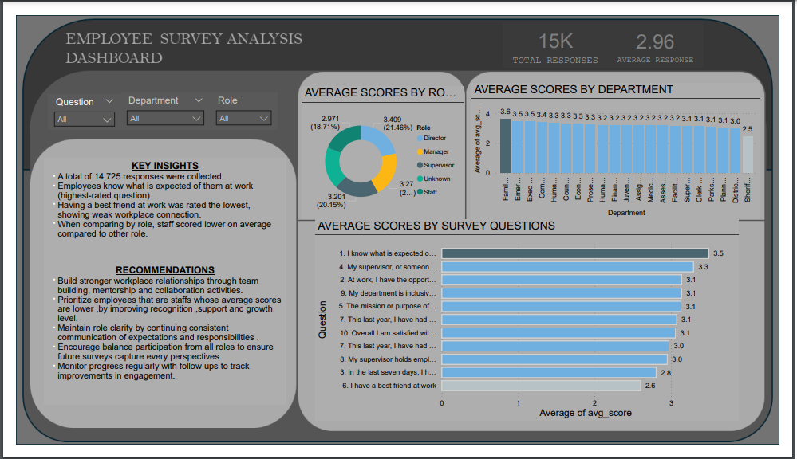

# Employee-Analysis

📊 Employee Engagement Survey Dashboard

This project analyzes 14,725 employee survey responses from Pierce County WA using SQL, Excel, and Power BI.
The goal is to uncover trends in employee engagement, highlight strengths and weaknesses, and provide actionable recommendations for improving workplace satisfaction.

---

🔍 Key Insights

1. Lowest-rated area – Many employees disagreed with the statement “I have a best friend at work”, suggesting weaker workplace relationships.

2. Highest-rated area – Employees generally agreed with “I know what is expected of me”, showing strong role clarity.

3. Department & role patterns – Staff-level employees reported lower average satisfaction scores compared to supervisors and managers.

4. Overall trend – Employees understand expectations but crave more connection, recognition, and workplace support.

---

🚀 Recommendations

1. Build stronger workplace relationships through team-building, mentorship, and collaboration activities.

2. Prioritize staff-level employees, who reported lower average scores, by improving recognition, support, and growth opportunities.

3. Maintain role clarity by continuing consistent communication of expectations and responsibilities.

4. Encourage balanced participation from all roles to ensure future surveys capture every perspective.

5. Monitor progress regularly with follow-up pulse surveys to track improvements in engagement.

---

🖼 Dashboard Preview

---

📂 Files in this Repository

Employee_Survey.pbix → (EMPLOYEE SURVEY.pbix)

Employee_Survey_Cleaned pdf→(EMPLOYEE SURVEY.pdf)

---

🛠 Tools & Skills Used

SQL → querying, filtering, aggregations, and role-based analysis

Excel → data cleaning & preparation

Power BI → dashboard development, visualization & storytelling

Data Analysis → uncovering trends, insights, and recommendations

---

✨ About This Project

This project demonstrates how raw survey data can be transformed into actionable insights by combining SQL queries, Excel cleaning, and Power BI dashboards.
It highlights the importance of data storytelling and translating analytics into clear recommendations for decision-making.

---

